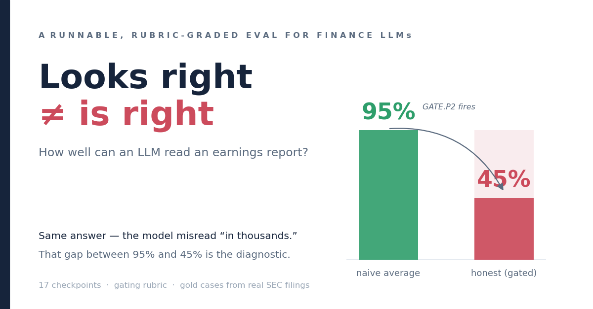

# finance-llm-evals



A runnable **suite** of evaluations measuring how well large language models perform real
**asset-management analyst workflows** — judged the way a finance professional actually judges
work: against a rubric, with every figure traced to a source filing, auto-fail "gates" for the
errors that quietly poison a memo, and credit for *calibrated uncertainty* rather than confident
guessing.

Most finance-LLM demos show a polished answer. This shows the **scoring system** behind the
answer: the workflow broken into checkpoints, a gating-plus-weighted rubric, gold cases cited to
SEC filings, and a grader that surfaces exactly *where* — and how badly — a model fails.

## See it in 30 seconds (no API key, no setup)

```bash
pip install -r requirements.txt     # one dependency: pyyaml
python -m harness demo              # grade a correct answer and a subtly-broken one, side by side
```

The demo runs a model that does Snowflake's quarter **correctly** but misreads one statement header
("in thousands" as "in millions"). Watch what the scoring does:

```
CASE snow-2026q2   model=oracle       gated 1.000   AllPass 1   gates: none
CASE snow-2026q2   model=scale_slip   gated 0.452   AllPass 0   gates: GATE.P2   (ungated 0.951)
```

The arithmetic is internally consistent, so the naive (**ungated**) score stays ~0.95. But one hard
**gate** fires on the scale misread and the **gated score collapses to 0.45.** That ~0.50 gap *is*
the finding: *can do the math, cannot be trusted to read a statement header.* Measuring that gap —
across five analyst and back-office workflows — is the whole repo.

## How the scoring works (30 more seconds)

Every workflow is broken into **checkpoints** (plan → extract → calculate → decide). Each checkpoint
has scored criteria, and a few are **gates** — auto-fail conditions for the errors that quietly
poison a memo (a unit/scale slip, a wrong fiscal period, a fabricated number, settling a basket that
doesn't reconcile). A normal mistake costs a few points; a **gate collapses the score and flags
exactly where and how badly** the model failed. Every gold figure is traced to a real SEC filing;
nothing is invented. Models also earn credit for **calibrated uncertainty** — saying "not
determinable from this packet" instead of guessing.

## The five evals — and how to run each

| Eval | What it tests | Run it (the perfect "oracle") | See it fail |
|---|---|---|---|
| **#1 — Earnings** | digest a 10-Q, reconcile the figures, flag what moved | `python -m harness run --case snow-fy2026q2` | `--model scale_slip` — thousands-vs-millions → **GATE.P2** |
| **#2 — Buffer ETF** | recompute a buffer ETF's cap & buffer **from the option strikes**; price the protection | `python -m harness run --case koct-op2026-anchor` | `--model free_lunch` — protection asserted with no cost → **GATE.FREELUNCH** |
| **#3 — DCF** | project FCFF, discount at WACC, **bridge EV→equity**, per share | `python -m harness run --case mcd-fy2025-dcf` | `--model bridge_omit` — EV÷shares, net-debt bridge skipped → **GATE.BRIDGE** |
| **#4 — Creation/redemption** | reconcile an AP's creation basket vs the PCF & NAV; **settle only if it ties** | `python -m harness run --case grin-create-2026` | `--model approve_break` — settle a basket that's $13,320 short → **GATE.RECON** |
| **#5 — Confirmation matching** | match two OTC swap confirmations field-by-field; **affirm only if the economics tie** | `python -m harness run --case irs-confirm-2026` | `--model affirm_match` — affirm a trade with a material rate break → **GATE.MATCH** |

Every `run` defaults to a perfect answer (scores 1.000); add `--model <name>` to watch a designed
flaw trip its gate. `python -m harness list` shows every case and variant ·
`python -m harness suite` scores them all · `python -m harness selftest` prints PASSED.

**Run a real model** (optional, needs an API key): add `--model live --endpoint <url> --model-id
<model>` with `OPENAI_API_KEY` set. The graded frontier-model runs are in [`outputs/`](outputs/).

> 📄 **Prefer prose?** [`PAPER.md`](PAPER.md) is the methodology write-up. Each eval also has a
> plain-language write-up in [`content/`](content/).

## The five evals in detail

- **Eval #1 — Quarterly earnings analysis.** Digest a 10-Q/earnings release, reconcile the figures,
  benchmark versus consensus, flag what moved. 17 checkpoints, 109 criteria, three gold cases
  (BlackRock, Microsoft, Snowflake).
- **Eval #2 — Defined-outcome ("buffer") ETF diligence** *(the one a generalist can't author)*.
  Given a prospectus, the fund's actual FLEX-option legs from its N-PORT filing, and a dated market
  snapshot: recompute the marketed cap and buffer **from the option strikes**, compute what a
  **mid-period buyer actually gets**, verify the marketing claims, and price the protection — with
  the **free-lunch gate** (downside protection asserted with no forgone-upside cost = auto-fail) as
  the signature. 18 checkpoints, 110 criteria, three market-snapshot cases on a real buffer ETF.
- **Eval #3 — Discounted-cash-flow valuation** *(the most-used model in research, and the one most
  often quietly wrong)*. Project unlevered free cash flow, discount at WACC, capitalize a terminal
  value, **bridge enterprise value to equity**, divide by shares — every number a closed-form
  consequence of a handful of inputs, so it is perfectly recomputable. The signature is **the DCF
  that looks right and is wrong**: on a real McDonald's FY2025 case the correct fair value is
  ~$228/share (≈20% overvalued vs the market) while the classic **EV÷shares blunder** (skipping the
  net-debt bridge) lands at ~$279 — only −2.6% from price, so the *wrong* method looks fair. The
  consistency spine is the **basis gate** (unlevered cash flow must meet WACC must meet the
  net-debt bridge), and the calibration signature is the **false-precision gate** (a decimal-precise
  target on a model that is 80% terminal value, where a 50bp discount-rate move shifts it ±15%,
  auto-fails). 18 checkpoints, 107 criteria, one real-10-K gold case, **run live against three
  frontier models**: the two strong ones do textbook DCF correctly (no gate, ~0.96); the weak one
  trips the FCF-definition gate on a real arithmetic error the eval localizes to one checkpoint.
- **Eval #4 — ETF creation/redemption basket reconciliation** *(the custodian back-office core,
  authored by someone who ran it)*. Given an Authorized Participant's tendered creation basket, the
  published PCF, and the NAV-based creation value, reconcile it line-by-line, value the basket and
  cash-in-lieu, compute the tie-out — and **settle only if it ties.** The signature is **GATE.RECON**:
  a model that returns SETTLE for a basket whose residual is out of tolerance auto-fails — the
  fund-accounting "tie out or stop" control, ported to an AI. The gold case is a creation that does
  not reconcile (a halted name's cash-in-lieu delivered at a stale prior-close price, short $13,320 on
  a $3.075M order — every in-kind line matches, only the cash plug is short); the gold answer is
  DO_NOT_SETTLE, localized to that line. A clean-settle counterweight case catches the over-cautious
  mirror (crying break on a basket that ties). 8 checkpoints, ~31 criteria, two gold cases. *(PCFs are
  NSCC-disseminated, not public filings, so this case is a constructed, mechanics-faithful scenario —
  real constituent securities and representative prices; fund, order, and break illustrative.)*
- **Eval #5 — OTC derivative confirmation matching** *(the derivatives sibling of #4 — and grounded in
  a real public message)*. Two counterparties each book their side of an interest-rate swap and send
  confirmations; the affirmation desk matches the economic terms field-by-field and **affirms only if
  they tie.** The signature is **GATE.MATCH**: a model that affirms ("matched") a trade whose economic
  terms do not tie auto-fails — the same "tie out or stop" control as reconciliation. The gold "our
  side" is the **real, publicly-downloadable FpML 5.10 sample confirmation** (`ird-ex01-vanilla-swap.xml`
  from fpml.org), so unlike #4 the gold is *cited, not constructed*. The counterparty confirmation
  carries a material break — a fixed rate of **6.05% where ours says 6.00%** (~5 bp, ~EUR 25,000/yr on
  EUR 50MM); every other term ties, and the two parties' trade ids differ *by design* (the materiality
  foil). Gold answer: MISMATCHED, do not affirm, localized to the fixed rate. A clean-match counterweight
  catches the over-cautious mirror. 8 checkpoints, ~33 criteria, two gold cases.

## What's here

| Path | Contents |
|---|---|
| [`workflow/`](workflow/) | Each workflow decomposed into measurable checkpoints (earnings: 17 · defined-outcome: 18 · DCF: 18 · creation/redemption: 8 · confirmation-matching: 8) |
| [`rubric/`](rubric/) | Gating + weighted, tiered rubrics — machine-readable atoms (`criteria*.yaml`), the frozen judge prompt (`judge.md`), and a `validate.py` linter |
| [`cases/`](cases/) | Gold cases — every figure cited to a real SEC filing (10-K / 10-Q / 8-K / 497K / N-PORT); **no invented numbers** (the creation/redemption case is the one exception: PCFs are not public, so it is a constructed, mechanics-faithful scenario over real securities) |
| [`harness/`](harness/) | The runnable scorer: one suite-agnostic engine + a module per eval; deterministic checks + gating + a pluggable LLM-judge interface; a live path for real models |
| [`outputs/`](outputs/) | The real graded model runs + failure taxonomies — [`eval2-live/`](outputs/eval2-live/) (two local models, the judge-vs-expert calibration), [`eval3-live/`](outputs/eval3-live/) (three frontier models on the DCF eval), [`eval4-live/`](outputs/eval4-live/) (three frontier models on creation/redemption reconciliation), and [`eval5-live/`](outputs/eval5-live/) (three frontier models on confirmation matching) |

## What the live runs found (eval #2)

Two open-weight models (a 27B reasoning model and a 72B non-reasoning one), run locally at zero API
cost, across a real Innovator buffer ETF under three market snapshots. The headline pattern: both
**nailed extraction and the single headline calculation** (the remaining cap for today's buyer),
and both **fell into the same payoff-reconstruction trap** — suggestive that the eval is catching
the *task's* difficulty, not one model's quirk (both subjects share a vendor lineage, so a
cross-family replication is the honest next step). The smaller reasoning model beat the larger
non-reasoning one on every case. And because the eval is **calculation-heavy by design**, swapping
the offline grader for a real LLM judge moved the scores by only **2–4.5 points** (versus ~15 on the
earnings eval) — the headline barely depends on the subjective part. Full traces, scored reports,
and the taxonomy are in [`outputs/eval2-live/`](outputs/eval2-live/); the calibration (judge vs. a
hand-graded expert sample, with caveats stated) is alongside.

Running real models also surfaced three calibration bugs in the grader itself — the kind a
synthetic self-test can't see because it's written around the grader's own assumptions. They were
fixed and everything re-graded; the log is in the taxonomy.

## What the live runs found (eval #3, DCF)

Three frontier models (Claude Opus 4.8 / Sonnet 4.6 / Haiku 4.5, via the Anthropic OpenAI-compatible
endpoint) on the real McDonald's FY2025 case, deterministic core + offline judge:

| Model | Gated | Gate fired | Math-spine score | WACC probe |
|---|---:|---|---:|---|
| **Opus 4.8** | 0.965 | none | 0.978 | refused |
| **Sonnet 4.6** | 0.955 | none | 0.978 | refused |
| **Haiku 4.5** | 0.692 | **GATE.C1FCF** | 0.646 | refused |

The two strong models do textbook DCF correctly — no gate fires, the whole calculation spine is clean,
fair value ~$228 (gold $227.82). The weak model's reported free cash flow **doesn't equal its own
build** (a +$2B/yr offset); the FCF-definition gate flags exactly that at C1, and the error cascades
into a wrong $138 valuation — one slip, surfaced and localized. The most consistent behavior across all
three is a subtle one (and the opposite of a capability gap): they **compute the discount rate
correctly** inside the model (~7.15%) and discount with it, yet, asked "what is the WACC *per the
10-K*?", answer "not disclosed" without volunteering the figure they just derived — a framing quirk the
eval isolates. And — as on both prior evals — the first real models surfaced **five
grader bugs** the synthetic tests were written around; all fixed, all re-graded, the oracle still
1.000/AllPass. Full matrix, traces, and the calibration log:
[`outputs/eval3-live/`](outputs/eval3-live/).

## What the gate taxonomy shows (eval #3, DCF)

A perfect ("oracle") answer scores 1.000/AllPass, and eleven deliberately-flawed variants each trip
**exactly one** gate, with a blast radius that matches the error's severity. The pattern *is* the
finding — the eval tells a catastrophic foundational error apart from a localized one:

| Flawed answer | Gate | Gated score | What it shows |
|---|---|---|---|
| `basis_mix` — unlevered FCF discounted at the cost of equity | **GATE.BASIS** (hard) | **0.35** | a wrong basis commitment poisons the whole valuation |
| `basis_late` — the same error *executed* (P1 looks clean) | **GATE.BASIS** (C5 hook) | 0.38 | caught by back-solving the discount rate from the model's own PVs |
| `scale_slip` — projections mislabeled thousands-vs-millions | **GATE.SCALE** (hard) | 0.73 | ungated stays ~0.99 (the math is consistent); the gate is the story |
| `bridge_omit` — EV÷shares, net-debt bridge skipped | **GATE.BRIDGE** (scoped) | 0.85 | the signature **localized** red — looks right, is wrong |
| `false_precision` — decimal target, no sensitivity block | **GATE.FALSEPRECISION** | 0.88 + flag | the calibration signature (80% terminal value, ±15% on 50bp) |
| `g_explode` (0.94) · `c7_sign` (0.93) · `c1_fcf` (0.81) | in-checkpoint | — | each zeroes only its checkpoint; `c1_fcf` also drags the *ungated* score where the bad FCF flows downstream |

Reproduce any row: `python -m harness run --case mcd-fy2025-dcf --model <name>`. The full design and
the McDonald's FY2025 gold case are in [`workflow/dcf-analysis.md`](workflow/dcf-analysis.md) and
[`cases/mcd-fy2025-dcf.case.yaml`](cases/mcd-fy2025-dcf.case.yaml).

## What the gate taxonomy shows (eval #4, creation/redemption)

The signature here is the one every fund-accounting desk runs on: **a basket that does not reconcile
does not settle.** The gold case is a creation that is short $13,320 — every in-kind share line ties,
only the cash-in-lieu plug is stale — so the most dangerous failure is also the highest-scoring one:

| Flawed answer | Gate | Gated score | What it shows |
|---|---|---|---|
| `approve_break` — all numbers right, **SETTLES the break** | **GATE.RECON** + flag | **0.86** | the signature: the highest-scoring failure is the catastrophic one — the control switched off |
| `scale_slip` — delivered cash read in thousands | **GATE.SCALE** (hard) | 0.66 | a mis-scaled tie-out |
| `cil_blind` — misses the cash-in-lieu substitution | **GATE.CIL** (scoped) | 0.55 | right *stop*, wrong root cause; RECON does **not** fire |
| `direction_flip` — creation read as redemption | **GATE.DIRECTION** (hard) | 0.36 | the whole order on the wrong footing — the biggest cascade |
| `fabricate_price` — invents the halted name's close | **GATE.FABRICATION** | 0.92 | the calibrated-refusal probe → G = 0 |

A second **clean-settle** gold case (the same order delivered correctly, so it ties) catches the
over-cautious mirror — a model that cries break on a basket that reconciles. The suite was hardened
by an adversarial gaming review (an approval *synonym* still trips GATE.RECON; a fabricated price
under a refusal label still trips GATE.FABRICATION). Design + gold:
[`workflow/creation-redemption-analysis.md`](workflow/creation-redemption-analysis.md),
[`cases/grin-create-2026.case.yaml`](cases/grin-create-2026.case.yaml).

## What the live runs found (eval #4, creation/redemption)

Three frontier models (Claude Opus 4.8 / Sonnet 4.6 / Haiku 4.5) on both gold cases:

| Model | Break case | Gate | Clean-settle case |
|---|---:|---|---:|
| **Opus 4.8** | 0.983 | none | 0.983 |
| **Sonnet 4.6** | 0.943 | none | 0.983 |
| **Haiku 4.5** | 0.496 | **GATE.SCALE** | 0.983 |

The two strong models reconcile to the dollar — in-kind MV $2,838,400, the cash-in-lieu valued at the
**struck** $112.40 (not the AP's stale $105.00), residual exactly **−$13,320**, **DO_NOT_SETTLE**
localized to the RBLX line, the refusal probe answered correctly. **Haiku catches that something is
wrong but its own arithmetic is off**: it overstates the in-kind value by exactly $200,000, which
flips the residual to **+$186,680** — so it concludes the basket is *over*-delivered when it is
actually *short*. It still refuses to settle (the right call), but the eval pins the error to the
valuation (GATE.SCALE) and the wrong answerable-twin. On the clean case all three correctly **SETTLE**
(no false break). **The honest negative result:** `GATE.RECON` — *settle a basket that does not
reconcile* — never fired; no frontier model approved the break. The capability gap showed up as
Haiku's $200k arithmetic slip, localized to one checkpoint, not as the marquee failure. Single model
family, n=1 per case — a cross-family run is the honest next step. Full matrix + traces:
[`outputs/eval4-live/`](outputs/eval4-live/).

## What the gate taxonomy shows (eval #5, confirmation matching)

The derivatives sibling of #4 — and the gold "our side" is a **real, publicly-downloadable FpML
message**, so the case is *cited, not constructed*. The break: a counterparty confirmation that ties
on every term except a **6.05% vs 6.00% fixed rate**. The signature is again the highest-scoring
failure:

| Flawed answer | Gate | Gated score | What it shows |
|---|---|---|---|
| `affirm_match` — all terms compared right, **affirms the broken trade** | **GATE.MATCH** + flag | **0.84** | the signature: the highest-scoring failure is the catastrophic one — the control switched off |
| `scale_slip` — notional read in thousands | **GATE.SCALE** (hard) | 0.64 | a mis-scaled comparison |
| `materiality_blind` — flags the *expected* trade-id diff as a break | **GATE.MATERIALITY** (scoped) | 0.61 | right verdict, wrong reason; MATCH does **not** fire |
| `direction_flip` — fixed payer/receiver inverted | **GATE.DIRECTION** (hard) | 0.47 | the trade read backwards — the biggest cascade |
| `fabricate_probe` — invents a mark-to-market | **GATE.FABRICATION** | 0.92 | the calibrated-refusal probe → G = 0 |

A clean-match counterweight case catches the over-cautious mirror (crying "mismatch" on a trade that
ties). The suite was hardened by an adversarial gaming review — a settlement-desk *go-ahead synonym*
("release for settlement", "book it") still trips GATE.MATCH; a fabricated mark-to-market asserted in
prose still trips GATE.FABRICATION. Design + gold:
[`workflow/confirmation-matching-analysis.md`](workflow/confirmation-matching-analysis.md),
[`cases/irs-confirm-2026.case.yaml`](cases/irs-confirm-2026.case.yaml).

## What the live runs found (eval #5, confirmation matching)

Three frontier models (Claude Opus 4.8 / Sonnet 4.6 / Haiku 4.5) on both gold cases:

| Model | Break case | Basis-point read | Clean case |
|---|---:|---|---:|
| **Opus 4.8** | **0.980** | ✅ 5 bp → ~EUR 25k/yr | 0.980 |
| **Sonnet 4.6** | 0.933 | ❌ "0.5 bp" → EUR 2,500 (**10× low**) | 0.980 |
| **Haiku 4.5** | 0.933 | ❌ "50 bp" → EUR 2,500,000 (**10× high**) | 0.980 |

All three match the two confirmations correctly — flag the fixed-rate difference as the break, treat
the differing trade ids as *expected*, return **MISMATCHED**, and affirm the clean case. **The honest
negative:** `GATE.MATCH` never fired — no model affirmed a broken trade. What separated them was a
classic finance trap, the **0.05% → basis-point conversion**: only Opus sized the break correctly
(~EUR 25k/yr); Sonnet called it "0.5 bp" and Haiku "50 bp" — wrong by 10×, in *opposite directions* —
and the eval localizes it to one checkpoint (`C3.impact`). As on every prior eval, the first real
models also surfaced **two grader-calibration bugs** (richer dict/prose answer shapes the synthetic
tests didn't anticipate); both fixed, oracle still 1.000/AllPass. Full matrix + traces:
[`outputs/eval5-live/`](outputs/eval5-live/).

## What the demo shows

`python -m harness demo` grades a model that does Snowflake's analysis **correctly** but misreads
the statement header ("in thousands" as "in millions"). Its **ungated** score stays ~0.99 (the
arithmetic is internally consistent), but a hard gate collapses the **gated** score to ~0.45 — a
**0.53 gap** that is the finding itself: *can do the math, cannot be trusted to read a statement
header.*

## Why a firm cares

Before any firm lets an AI do analyst work, it needs to know *whether — and exactly where — to
trust it.* A blended accuracy number can't answer that. This suite catches the errors that quietly
poison a memo (scale, period, fabrication, GAAP-vs-non-GAAP for earnings; wrong fund vintage,
strike-scale, stated-vs-remaining terms, and the free lunch for buffer ETFs; the levered/unlevered
basis mix, the missing net-debt bridge, and false precision for a DCF; the create/redeem direction,
a stale cash-in-lieu, and **settling a basket that does not reconcile** for fund servicing; a trade
direction, day-count, or rate break, and **affirming a confirmation that does not tie** for
derivatives ops), localizes each to the checkpoint that owns it, and tells "looks right" apart from
"is right." A firm uses it as an
**acceptance test** (which model is deployable, and where it needs a guardrail) and a **regression
test** (did a model/prompt change help or hurt, and where).

## Why it's built this way

The design follows the public state of the art — OpenAI's **HealthBench** (expert rubric criteria
graded by an LLM judge), **FinanceBench** (every answer tied to an evidence string), **FinQA /
TAT-QA** (executed numeric tolerance), the **Vals AI Finance Agent Benchmark** (checkpoint scoring
of an end-to-end analyst task), and **FailSafeQA** (rewarding calibrated refusal) — and composes
them into a runnable whole, then extends it to a derivatives-overlay product that the public
benchmarks don't cover.

See [`PLAN.md`](PLAN.md) for the phase roadmap and [`CLAUDE.md`](CLAUDE.md) for full project context.

## License

MIT — see [`LICENSE`](LICENSE). Gold-case figures are public-record facts from SEC EDGAR,
attributed to their source filings.
